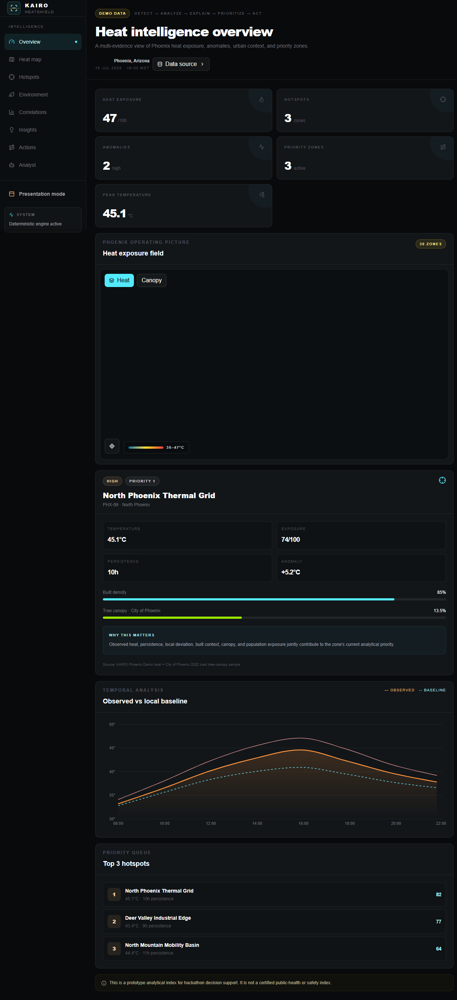
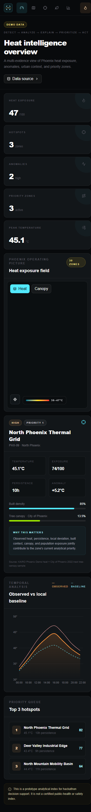
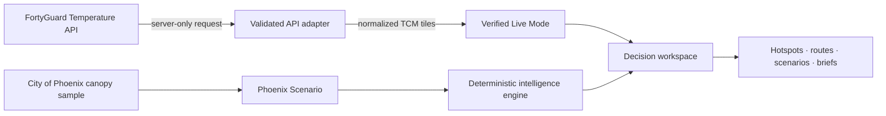

<div align="center">
  

  # KAIRO HeatShield

  **Urban heat intelligence that moves from detection to field-ready action.**

  [](https://kairo-heatshield.vercel.app)
  [](https://kairo-heatshield.vercel.app/presentation)
  [](https://nextjs.org/)
  [](https://www.typescriptlang.org/)
  [](#quality-and-verification)

  Built for **FortyGuard Global AI Hackathon ’26**  
  Primary track: **Resilient Cities & Infrastructure**
</div>

---

## The problem

A temperature surface tells a city **where heat is**. It does not tell a resilience team which blocks deserve attention first, why one zone ranks above another, what evidence supports that decision, or what should happen next.

KAIRO closes that operational gap with one legible decision chain:

> **Detect → Analyze → Explain → Prioritize → Act**

It combines verified FortyGuard temperature output with explicitly labeled contextual evidence, transparent scoring, route comparison, intervention screening, and concise assessment briefs. The result is a decision-support workspace designed for municipal teams, not another decorative heat map.

## Product at a glance

<table>
  <tr>
    <td width="67%">
      
    </td>
    <td width="33%">
      
    </td>
  </tr>
  <tr>
    <td align="center"><strong>Desktop operations workspace</strong></td>
    <td align="center"><strong>Responsive field view</strong></td>
  </tr>
</table>

### Verified live proof

- A completed FortyGuard Phoenix TCM activity returns **1,055 normalized temperature tiles**.
- The live map renders only values actually returned by FortyGuard, with no hidden fallback or silent scenario substitution.
- Every live tile can be inspected for its exact TCM value, with a clearly labeled relative scale for narrow observed ranges.
- The Canopy control opens the labeled City of Phoenix scenario layer instead of presenting a disabled or ambiguous action.
- Credentials stay server-side; the browser never receives the API key or raw upstream payload.
- API responses pass schema validation before normalization and visualization.

### Decision capabilities

| Stage | What KAIRO adds |
| --- | --- |
| **Detect** | Hyperlocal thermal field and peak/mean/minimum TCM summaries |
| **Analyze** | Robust anomaly detection, exposure scoring, persistence, and correlations |
| **Explain** | Visible evidence provenance and human-readable drivers for every priority |
| **Prioritize** | Deterministic hotspot ranking across 30 Phoenix analysis zones |
| **Act** | Cooler-route comparison, intervention screening, and downloadable field briefs |

## What makes it different

1. **A decision layer, not only a visualization.** Every signal continues into a priority, explanation, and next assessment step.
2. **Evidence boundaries are visible.** Observed, derived, public-data, and modeled scenario fields remain separate and labeled.
3. **Explainability is part of the product.** Exposure weights, median/MAD anomalies, Pearson/Spearman associations, and ranking logic are documented instead of hidden behind a score.
4. **The Analyst is bounded.** It routes questions to deterministic local analytical tools; it does not invent measurements or depend on an unrestricted runtime LLM.
5. **Live and scenario modes never blur.** The verified FortyGuard result proves integration; the Phoenix Scenario demonstrates the complete operational workflow.

## Architecture



The production path uses a server-only `POST /v1/heatmap` request, bounded polling through `GET /v1/status/{activity_id}`, Zod validation, geometry normalization, and a responsive Canvas renderer. The analytical layer is pure TypeScript and independently tested.

## Technology

- **Application:** Next.js 16 App Router, React 18, strict TypeScript
- **Interface:** Tailwind CSS, local shadcn-style primitives, Lucide icons, Recharts
- **Geospatial:** GeoJSON, Turf helpers, responsive Canvas choropleth
- **Validation:** Zod at external-data boundaries
- **Testing:** Vitest for analytical, routing, scoring, and API-normalization logic
- **Deployment:** Vercel with encrypted server-side environment configuration

## Run locally

### 1. Install

```bash
npm install
```

### 2. Configure the server credential

Copy `.env.example` to `.env.local`, then add a FortyGuard key:

```dotenv
FORTYGUARD_API_KEY=your_server_side_key
```

`FORTYGUARD_BASE_URL` is optional. Never expose the key through a `NEXT_PUBLIC_` variable or commit `.env.local`.

### 3. Start

```bash
npm run dev
```

Open [http://localhost:3000](http://localhost:3000). The Phoenix Scenario works without a key; verified Live Mode is enabled only after a valid FortyGuard response completes.

## Quality and verification

```bash
npm run lint
npm run check
npm run build
```

Current release gate:

- **ESLint:** clean
- **Vitest:** 25/25 passing
- **Production build:** successful, strict TypeScript included
- **Responsive verification:** desktop and 375 px mobile, no horizontal overflow
- **Interaction verification:** Canopy transition, live-tile inspection, tablet, and mobile-landscape checks
- **Production checks:** public routes return 200; CSP and HSTS are enabled

## Documentation

| Document | Purpose |
| --- | --- |
| [Submission write-up](docs/SUBMISSION_WRITEUP.md) | Concise project narrative for judges |
| [Three-minute demo script](docs/DEMO_SCRIPT.md) | Timed presentation flow |
| [Data methodology](docs/DATA_METHODOLOGY.md) | Provenance, transformations, and analytical boundaries |
| [FortyGuard integration](docs/API_INTEGRATION.md) | Authentication, polling, validation, and failure behavior |
| [Architecture](docs/ARCHITECTURE.md) | Components, data flow, security, and deployment |
| [Hackathon evaluation](docs/HACKATHON_EVALUATION.md) | Evidence against the official judging rubric |

## Data responsibility and limitations

KAIRO is a hackathon decision-support prototype. It is **not** a certified safety, health, navigation, engineering, or construction tool. Scenario reductions are screening estimates, not forecasts or guaranteed outcomes. Correlation does not imply causation. Thirty canopy percentages come from the City of Phoenix 2022 Shade Study sample; other contextual scenario fields are deterministic and labeled. Current FortyGuard API coverage is limited to the United States.

## Team

Built by **Marwan Abdelghaffar and team** for FortyGuard Global AI Hackathon ’26.

<div align="center">
  <strong>KAIRO HeatShield</strong><br />
  See the heat. Explain the risk. Prioritize the next move.
</div>
