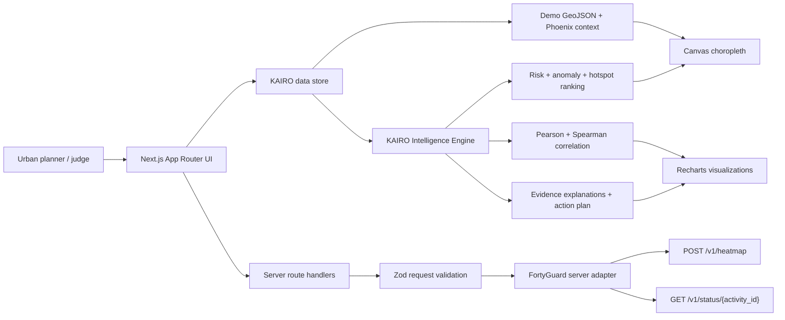

# KAIRO HeatShield architecture

## System intent

KAIRO is an environmental intelligence system following **Detect → Analyze → Explain → Prioritize → Act**. It is not dependent on an LLM. A deterministic, testable analytical core powers both Demo and Live modes.

## Frontend

- Next.js App Router with strict TypeScript and React.
- A persistent application shell provides deep links to Overview, Map, Hotspots, Environment, Correlations, Insights, Actions, Analyst, and Presentation Mode.
- Server Components own route entry points; interactive map, filters, mode switching, charts, and analyst controls live in explicit Client Components.
- Tailwind CSS supplies tokens and layout. Local shadcn-style primitives provide accessible buttons, badges, cards, tabs, tables, and dialogs.
- A responsive 2D Canvas renderer draws GeoJSON zones, hotspot markers, dynamic legends, and the selected-zone state without relying on WebGL availability.
- Recharts renders temporal trends, scatter plots, and correlation comparisons. Every chart has a nearby textual or tabular summary.

## Data modes

### Phoenix Scenario

- Default and fully functional without credentials.
- Uses 30 Phoenix analysis zones in a deterministic GeoJSON grid.
- All scenario surfaces visibly display **PHOENIX SCENARIO** and never claim a live upstream result.
- Urban variables are an offline analytical sample whose methodology and authoritative source basis are documented in `DATA_METHODOLOGY.md`.

### Live Mode

- Enabled only when `FORTYGUARD_API_KEY` exists on the server.
- A client submits a validated heatmap request to KAIRO's route handler; the server attaches the secret and calls the documented FortyGuard endpoint.
- The server performs finite status polling and returns a normalized KAIRO payload only after an upstream completion.
- A failure never silently falls back while retaining a LIVE label. The UI exposes the error and keeps the Phoenix Scenario explicit.

## Backend and FortyGuard boundary

- `lib/fortyguard/client.ts`: timeout, authentication header, content-type, safe errors, HTTP status mapping, retry hints.
- `lib/fortyguard/schemas.ts`: request/response validation, closed-polygon constraint, date/filter discriminants, granularity enum, result envelope.
- `lib/fortyguard/heatmap.ts`: submission and normalization.
- `lib/fortyguard/status.ts`: bounded controlled polling and terminal-state handling.
- `lib/fortyguard/capabilities.ts`: configuration/documented-plan reporting; it does not call a fabricated upstream discovery endpoint.
- `app/api/fortyguard/*`: same-origin server routes. Request bodies have a byte limit and no secret is serialized to the browser.

## Intelligence engine

All analytical functions are pure TypeScript and run independently of FortyGuard availability.

- **Heat Exposure Index:** transparent weighted composite of normalized temperature, heat persistence, heat-index uplift, temporal deviation, and spatial intensity. Configuration and thresholds are centralized.
- **Anomalies:** robust z-score using median and median absolute deviation (MAD), with a standard-deviation fallback when MAD is zero.
- **Hotspots:** spatially aware ranking that combines heat exposure, anomaly, persistence, exposure context, and neighborhood intensity; it is not a temperature-only sort.
- **Correlations:** Pearson for linear association and Spearman for monotonic association. Results expose coefficient, N, direction, and labeled strength; samples below the minimum size are withheld.
- **Priority:** heat, anomaly, persistence, low vegetation/built context, and population exposure. Output is decision-support ranking, not a health-impact estimate.
- **Explanations/actions:** deterministic evidence templates use measured and derived fields and avoid causal claims.

## External data

- The Phoenix urban context uses U.S. Census Bureau ACS population variables and USGS National Land Cover Database concepts for developed cover and vegetation context.
- The bundled dataset is intentionally versioned and offline so the three-minute demo and Vercel build do not depend on third-party availability.
- Every value is identified as Demo/derived context; provenance, spatial join, resolutions, and limitations are documented in `DATA_METHODOLOGY.md`.

## State and storage

- No database is required for the hackathon build.
- Demo analytical state is bundled read-only.
- User selection and current data mode are transient client state.
- FortyGuard activity IDs exist only for the duration of the server request and are returned safely; API keys are never persisted.

## Security

- Secret keys are read only in server-only modules.
- Zod validates every public request and upstream envelope used by code.
- Requests use AbortController timeouts, bounded polling, finite response-body reads, and safe error messages.
- The live route rejects oversized input and limits Phoenix's default polygon to a small, documented area suitable for Basic plans.
- `.gitignore` excludes environment files.

## Deployment

- Standard Next.js deployment on Vercel; no custom `vercel.json` is required.
- The Phoenix Scenario builds and runs with no environment variables.
- `FORTYGUARD_API_KEY` enables Live Mode. `FORTYGUARD_BASE_URL` is optional and defaults to the verified production origin.
- Production verification covers HTTP responses, route navigation, visual behavior at desktop/mobile sizes, console errors, and secret non-exposure.

## Scalability path

For a city-scale production version, move analytical jobs to a queue, store normalized observations in spatial storage such as PostGIS, cache immutable completed activities, execute correlation/feature engineering in workers, and add tenant-specific access control. The normalized domain model and server adapter already isolate these future changes from the UI.
